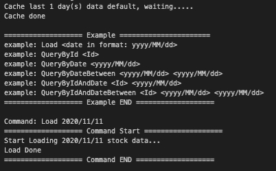
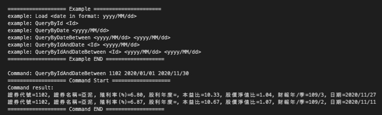

# 在家作業

## 目的

利用 台灣證券交易所 提供的 [個股日本益比、殖利率及股價淨值比](https://www.twse.com.tw/zh/page/trading/exchange/BWIBBU_d.html) 實作

- 依照證券代號 搜尋最近n天的資料
- 指定特定日期 顯示當天本益比前n名
- 指定日期範圍、證券代號 顯示這段時間內殖利率 為嚴格遞增的最長天數並顯示開始、結束日期

## 說明

> 該程式主要將資料儲存於 **記憶體** 中，重啟程式會將緩存資料清除。

程式主要分為3部分： `models`, `repos`, `services`， 以下為各部分之說明。

- Models： EntityFramwork 的定義與設定。
- Repos： 與第三方服務端的連接物件。
- Services： 商業邏輯。

> - 理論上以上模組都能直接套用在 MVC 的專案中。
> - 資料讀取的程式邏輯未來可以用 CronJob 等方式定期呼叫。

### **該專案主要展示程式編寫能力。**

## 範例

- 讀取 `2020年11月11日` 的資料
  > Load 2020/11/11

- 搜尋 代號`1102` 由`2020年1月1日`～`2020年11月30日` 之間的資料 （視 Load 指令儲存的資料而定）
  > QueryByIdAndDateBetween 1102 2020/01/01 2020/11/30

## 測試

> **尚在努力中。。。**
